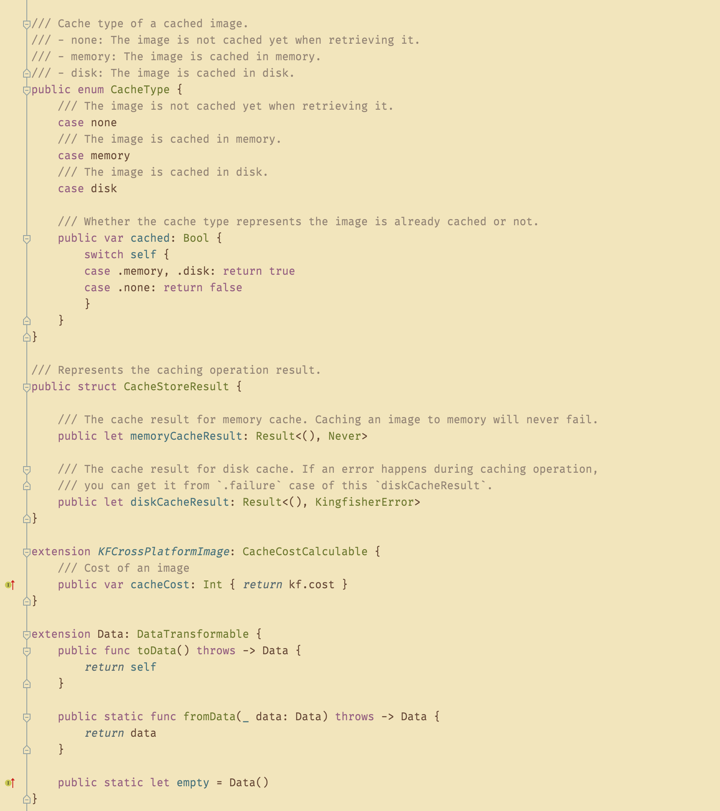

# gruvbox-material-appcode-theme
A simple(humble) AppCode theme base on [Gruvbox Material (light soft ver)](https://github.com/sainnhe/gruvbox-material).

**Note: Only adjusted for Swift.**

## Screenshot

1. The code is from [Kingfisher](https://github.com/onevcat/Kingfisher/blob/fa8e334b604177bd2df9f033b87c0be6eeffded8/Sources/Cache/ImageCache.swift).
2. The font is [Fira Code](https://github.com/tonsky/FiraCode) (with ligtures disabled).
